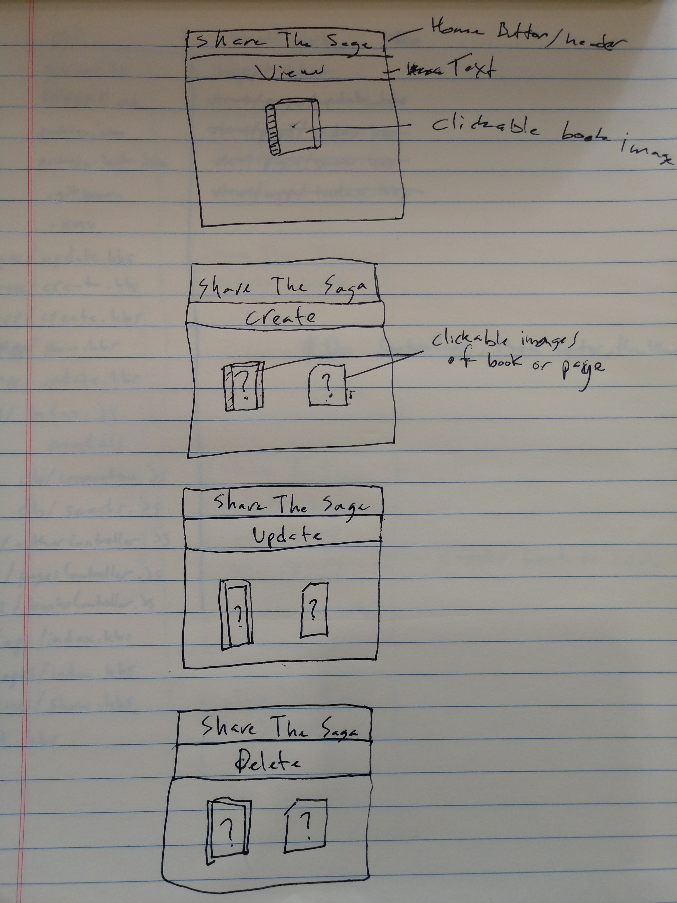
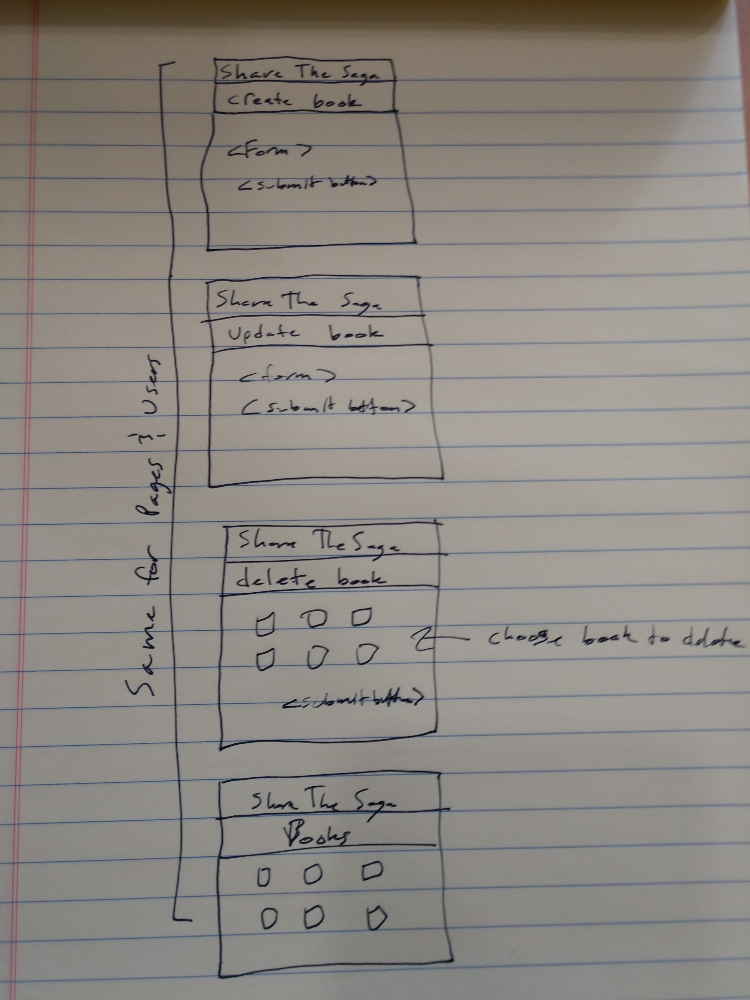

**PROJECT DESCRIPTION**

Share The Sage is a full stack web application for creating and organizing eBooks.

**Below is a link to the app itself**

https://sleepy-springs-79124.herokuapp.com/

**Below is a link to the Trello Board**

https://trello.com/b/OaBcDOi6/share-the-saga

**Below is a link to the wireframe/ERD/User Story Flowchart images**

**Below is a list of technologies/libraries/frameworks/dependencies and resources... think of this section as a citation of sources**

jQuery, Bootstrap, MondoDB, Mongoose, Express.js, Handlebars.js, Node.js, method-override, npm, nodemon, Heroku, Github. The following projects were used as reference points for skeleton: chirp-app and mehn-lab.

**Below is a list of goals for version 2**

- version 2 goal: allow multiple users to collaborate on books together.
- version 2 goal: allow for version control style editing to take place.
- version 2 goal: add full CRUD functionality to all models.
- version 2 goal: allow multiple file types to be uploaded as pages.
- version 2 goal: create social interaction aspect.

**Special Thanks**

- Atarius Armstrong
- Mark Haley
- Conrad Casper
- William Njie
- JB Watson
- Daniel Mishael
- Andrew McIntosh
- Destin Floyd
- Joseph Kim
- Shomari Pope
- Stanley Kimani
- Spencer Merryman
- Cameron Gunter
- Noah Harvey
- James Royals

for inspiration, motivation, and guidance along the way!